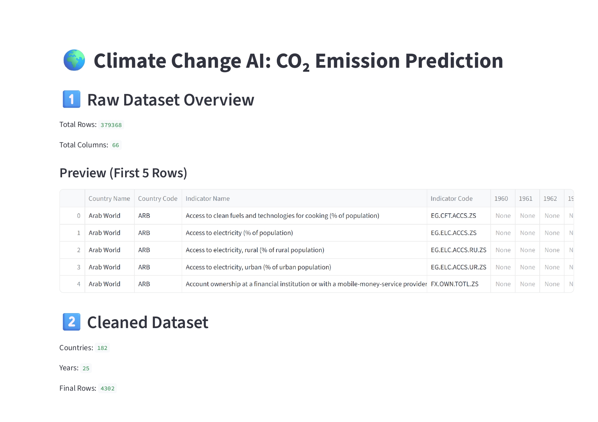
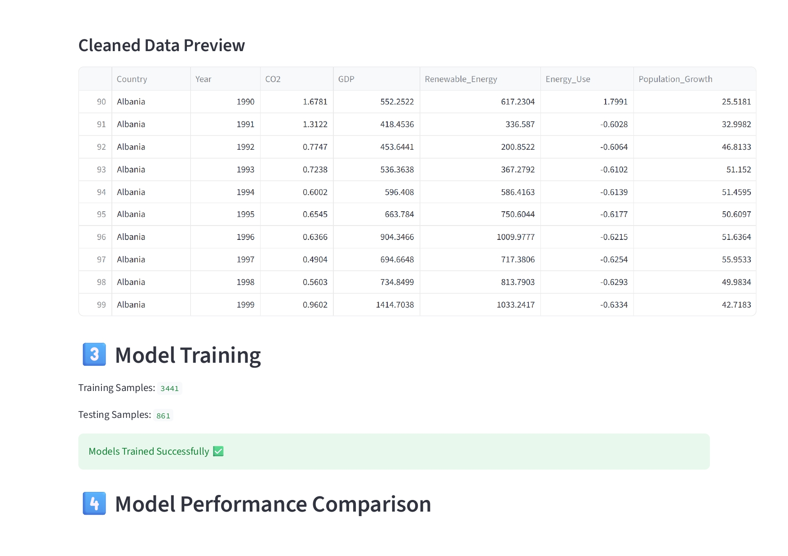
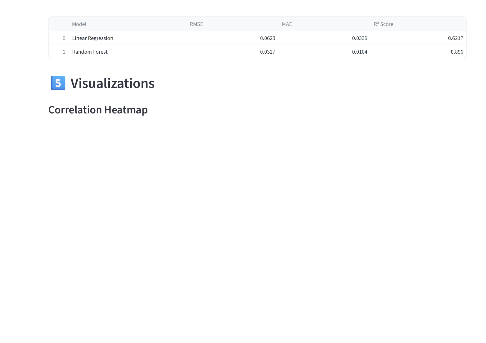
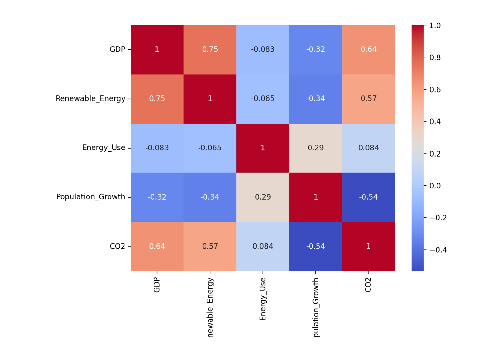
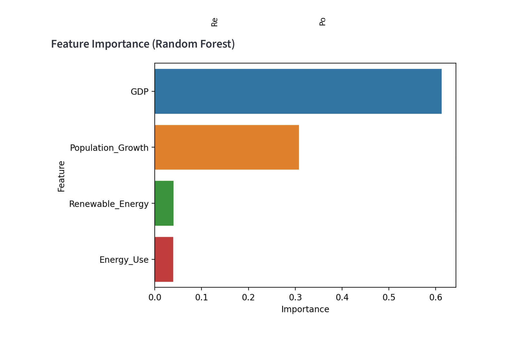
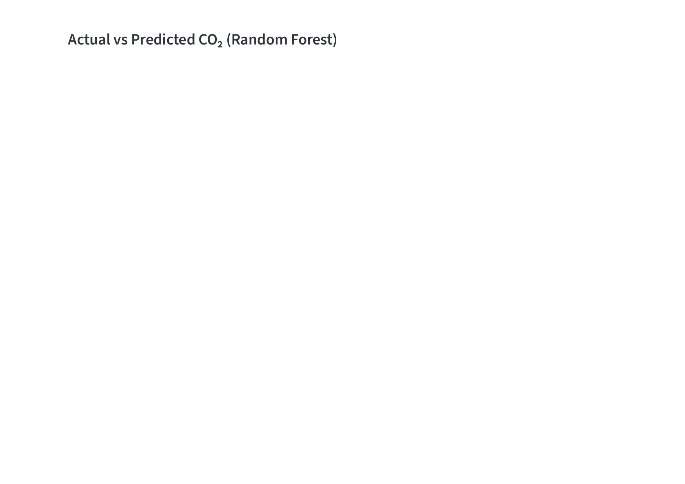
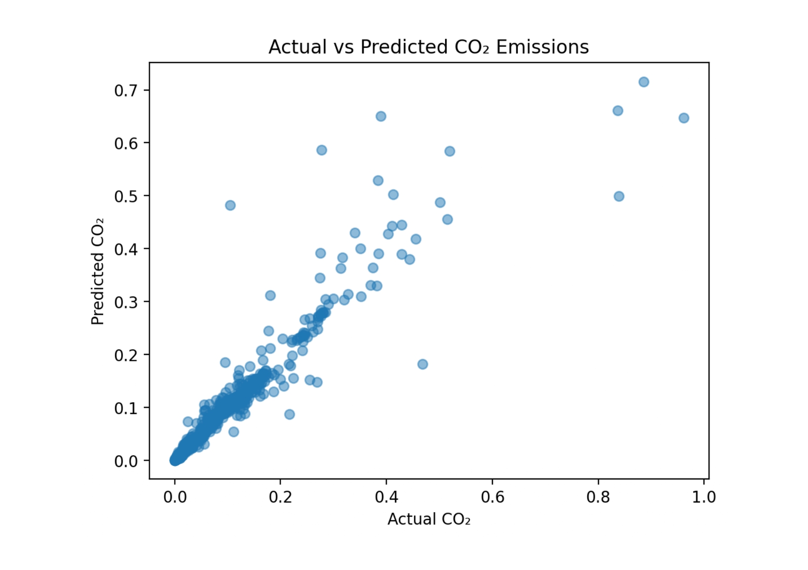
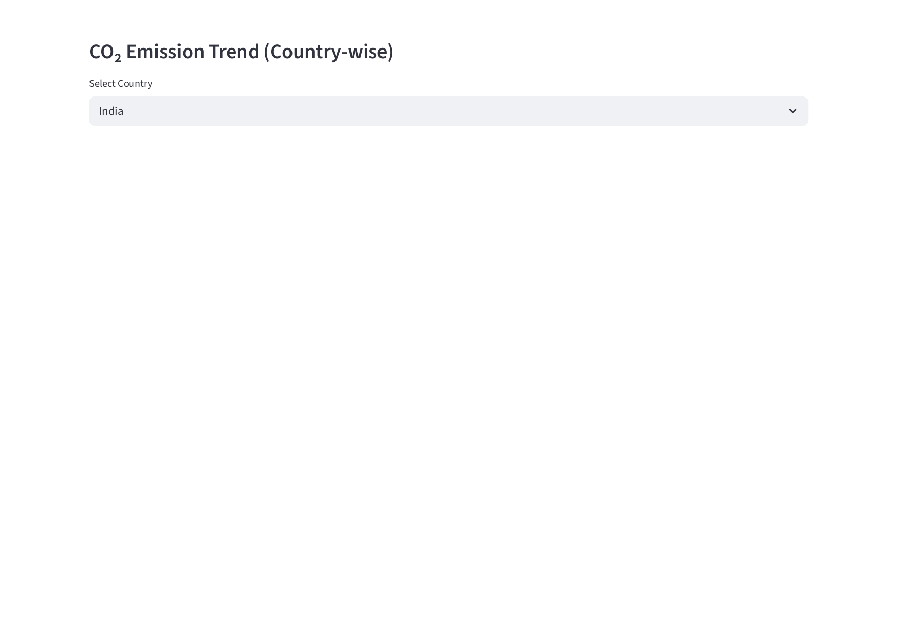
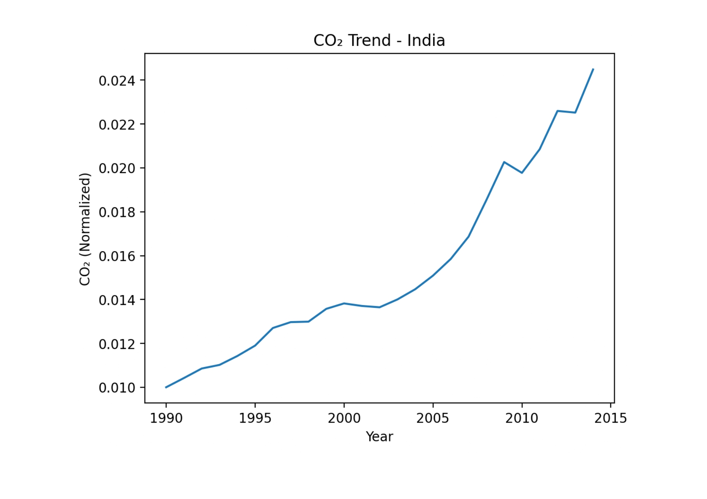

# 🌍 Climate Change AI: Tackling Climate Change with Machine Learning

## 📌 Project Overview

Climate change is one of the most critical global challenges. Predicting carbon emissions can help policymakers design better environmental strategies.

This project applies **Machine Learning models** to analyze global climate and economic indicators and **predict CO₂ emissions**. The system uses data from the **World Bank World Development Indicators dataset** and compares multiple ML algorithms to identify the most accurate model.

The project demonstrates how **data-driven insights** can support climate mitigation strategies.

---

# 🎯 Objectives

* Analyze historical climate and economic data
* Predict CO₂ emissions using machine learning models
* Compare model performance
* Visualize climate trends across countries
* Provide insights for climate policy planning

---

# 📊 Dataset

Dataset Source: World Bank – World Development Indicators

Due to GitHub file size limits, the dataset is **not included in this repository**.


---

# 🗂 Project Structure

```
Climate-Change-ML-Model
│
├── data/
│   └── WDIData.csv
│
├── src/
│   ├── data_preprocessing.py
│   └── model.py
│
├── main.py
├── co2_model.pkl
├── requirements.txt
├── README.md
└── .gitignore
```

---

# ⚙️ Technologies Used

* Python
* Machine Learning
* Streamlit
* Pandas
* NumPy
* Matplotlib
* Seaborn
* Scikit-learn

---

# 🤖 Machine Learning Models

The following models were implemented:

### Linear Regression

A simple statistical model used for predicting CO₂ emissions based on independent variables.

### Random Forest

An ensemble learning model that improves prediction accuracy by combining multiple decision trees.

Random Forest performed better because it captures **non-linear relationships** in the data.

---

# 📈 Model Performance

| Model             | RMSE    | MAE    | R² Score |
| ----------------- | ------- | ------ | -------- |
| Linear Regression | 0.0623  | 0.0339 | 0.6217   |
| Random Forest     | 0.0327  | 0.0104 | 0.896    |

---

# 📊 Dataset Summary

| Dataset Stage        | Details |
| -------------------- | ------- |
| Raw Dataset Rows     | 379,368 |
| Raw Dataset Columns  | 66      |
| Countries            | 182     |
| Years                | 25      |
| Cleaned Dataset Rows | 15,066  |

---

# 📉 Features Used

The model uses the following indicators:

* GDP (current US$)
* Renewable energy consumption (%)
* Electric power consumption
* Population growth
* Year
* Country

These features influence CO₂ emission levels.

---

# 📊 Visualizations

The project generates multiple charts including:

* CO₂ Emissions Trend by Country
* GDP vs CO₂ Emissions
* Renewable Energy vs CO₂ Emissions
* Feature Importance Graph
* Model Prediction Comparison

These visualizations help understand global climate patterns.

---

# 🖥 System Workflow

1. Load World Bank dataset
2. Clean and preprocess data
3. Handle missing values
4. Select important features
5. Train ML models
6. Evaluate model performance
7. Generate predictions
8. Visualize results

---

# 🚀 How to Run the Project

### 1️⃣ Clone Repository

```
git clone https://github.com/RutvikCodez/Climate-Change-ML-Model.git
```

---

### 2️⃣ Install Dependencies

```
pip install -r requirements.txt
```

---

### 3️⃣ Download Dataset

Download from World Bank and place in:

```
data/WDIData.csv
```

---

### 4️⃣ Run Application

```
streamlit run main.py
```

The dashboard will open in your browser.

---

# 📸 Output Screenshots

```









```

---

# 🔮 Future Improvements

* Add more climate indicators
* Use Deep Learning models such as LSTM
* Implement sector-wise emission prediction
* Build a real-time climate monitoring dashboard
* Deploy the system as a web application

---

# 👨‍💻 Contributors

**Project Leader**

Rutvik Darji

**Team Member**

Hepin Suthar

---

# 🌱 Conclusion

This project demonstrates how machine learning can be applied to analyze climate data and predict CO₂ emissions. The results show that ensemble models like Random Forest provide better accuracy for complex environmental datasets.

Such data-driven systems can help governments and researchers develop effective climate mitigation strategies.

---
